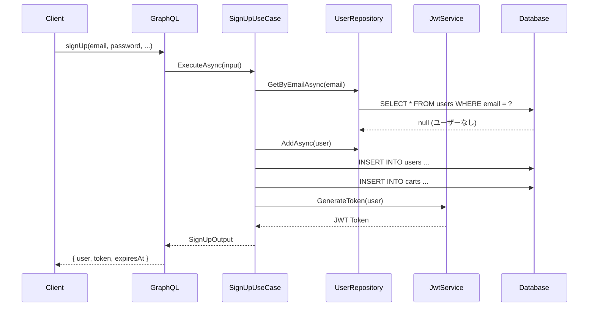

# EcSiteBackend アーキテクチャドキュメント

## プロジェクト概要

EcSiteBackend は、GraphQL ベースの EC サイト向けバックエンド API システムである。クリーンアーキテクチャの原則に従い、ビジネスロジックとインフラストラクチャの関心事を明確に分離している。

## 技術スタック

- **.NET 8.0** - アプリケーションフレームワーク
- **ASP.NET Core** - Web フレームワーク
- **GraphQL (HotChocolate)** - API 層
- **Entity Framework Core** - ORM
- **PostgreSQL** - データベース
- **JWT** - 認証トークン
- **xUnit** - 単体テスト
- **Docker** - コンテナ化

## アーキテクチャ構成

### レイヤー構造

```
┌─────────────────────────────────────────────────────┐
│                 Presentation Layer                   │
│            (GraphQL API / WebAPI)                   │
├─────────────────────────────────────────────────────┤
│                 Application Layer                    │
│     (Use Cases / DTOs / Interfaces)                │
├─────────────────────────────────────────────────────┤
│                   Domain Layer                       │
│        (Entities / Enums / Constants)              │
├─────────────────────────────────────────────────────┤
│               Infrastructure Layer                   │
│    (DB Context / Repositories / Services)          │
└─────────────────────────────────────────────────────┘
```

### 依存関係

```
Presentation → Application → Domain
     ↓             ↓
Infrastructure → Domain
```

- Presentation は、Application と Infrastructure に依存
- Application は Domain に依存
- Infrastructure は Application と Domain に依存
- Domain は他のレイヤーに依存しない

## 各レイヤーの責務

### Domain Layer

ビジネスルールとエンティティを定義する最も重要なレイヤーである。

- **Entities**: ビジネスエンティティ（User, Product, Order 等）
- **Enums**: ビジネスで使用する列挙型
- **Constants**: ドメイン固有の定数（RoleNames 等）

### Application Layer

ビジネスロジックとユースケースを実装する。

- **UseCases**: ビジネスユースケースの実装
  - `Interfaces`: ユースケースのインターフェース
  - `Interactors`: ユースケースの具体的な実装
  - `InputOutputModels`: ユースケースの入出力モデル
- **DTOs**: データ転送オブジェクト
- **Common**: 共通機能
  - `Interfaces`: リポジトリやサービスのインターフェース
  - `Exceptions`: カスタム例外
  - `Constants`: エラーコードやメッセージ
  - `Mappings`: AutoMapper プロファイル
  - `Settings`: アプリケーション設定

### Infrastructure Layer

外部システムとの連携を担当する。

- **DbContext**: Entity Framework Core のコンテキスト
- **Persistence/Repositories**: リポジトリパターンの実装
- **Services**: 外部サービスの実装（JWT、パスワードハッシュ等）
- **Migrations**: データベースマイグレーション

### Presentation Layer

クライアントとのインターフェースを提供する。

- **GraphQL**: GraphQL スキーマとリゾルバー
  - `Queries`: クエリ定義
  - `Mutations`: ミューテーション定義
  - `Types`: GraphQL 型定義
  - `Filters`: エラーフィルター
- **Startup**: DI コンテナ設定とミドルウェア設定
- **Program**: アプリケーションエントリーポイント

## 認証・認可設計

### 認証フロー



### JWT トークン構造

JWT トークンには以下のクレームが含まれる：

- `nameid`: ユーザー ID
- `email`: メールアドレス
- `unique_name`: フルネーム
- `firstName`: 名
- `lastName`: 姓
- `roles`: ユーザーロール（今後実装）
- `exp`: 有効期限（発行から 60 分）
- `iss`: 発行者（EcSiteBackend）
- `aud`: 対象者（EcSiteBackendClient）

## エラーハンドリング

### カスタム例外階層

```
ApplicationException (基底クラス)
├── ValidationException - バリデーションエラー
├── NotFoundException - リソース未発見
├── ConflictException - リソース競合
├── UnauthorizedException - 認証エラー
├── ForbiddenException - 認可エラー
└── BusinessRuleException - ビジネスルール違反
```

### エラーレスポンス形式

```json
{
  "errors": [{
    "message": "エラーメッセージ",
    "extensions": {
      "code": "ERROR_CODE",
      "details": { ... }
    }
  }]
}
```

## データベース設計

主要なエンティティとその関係：

- **User**: ユーザー情報
- **Cart**: ショッピングカート（1:1 with User）
- **Product**: 商品情報
- **Order**: 注文情報
- **Payment**: 支払い情報
- **Review**: 商品レビュー

詳細は`docs/database.md`を参照。

## 開発・実行方法

### 環境構築

```bash
# リポジトリのクローン
git clone [repository-url]
cd EcSiteBackend

# PostgreSQLの起動
docker-compose up -d

# 依存関係の復元
dotnet restore

# データベースマイグレーション
cd src/EcSiteBackend.Presentation/EcSiteBackend.WebAPI
dotnet ef database update
```

### アプリケーション実行

```bash
# WebAPIプロジェクトで実行
cd src/EcSiteBackend.Presentation/EcSiteBackend.WebAPI
dotnet run

# GraphQL Playgroundにアクセス
# http://localhost:5000/graphql
```

### テスト実行

```bash
# 単体テスト
dotnet test tests/EcSiteBackend.UnitTests

# 統合テスト
dotnet test tests/EcSiteBackend.IntegrationTests
```

## 設定管理

アプリケーション設定は`secrets.json`で管理する：

- 接続文字列
- JWT 設定（Secret、Issuer、Audience、有効期限）

本番環境では環境変数または適切なシークレット管理サービスを使用すること。
